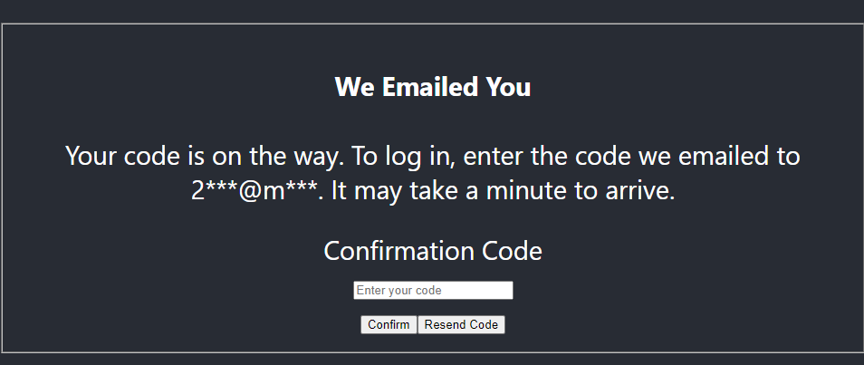
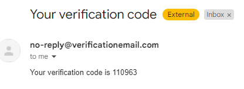

# amplify-cognito-node-test

Things I did

npm install -g @aws-amplify/cli

npx create-react-app amplify-cognito-node

In my AWS account, I created a new user, and gave them administrator-access-amplify permissions. I then created access keys for the new user.

amplify configure

Add the user details

amplify init

Everything should work successfully - if not, try making another user and giving full administrator access, not just amplify.
If everything worked successfully, you should see an "amplify" directory appear, and a file called src/aws-exports.js

amplify add auth

Select default configuration, then email, then done (for this test only)

amplify push

After a few mins, should see "deployment state saved succesfully".

Next up we need to create the main authentication system :)

npm install aws-amplify @aws-amplify/ui-react

Create a new file in src/ called Dashboard.js and add the code as shown in my file. (THIS SHOULD BE WITHIN THE AMPLIFY APP DIRECTORY, NOT THE ROOT eg. for me, amplify-cognito-node/inprov-test/src/Dashboard.js)

In App.js, I added a signin button to redirect to the dashboard when clicked.

Note that I followed a tutorial found at: https://medium.com/aws-in-plain-english/build-an-authentication-system-with-aws-amplify-cognito-and-react-2be3d3fe181b

However, I encountered many problems regarding files being in the wrong places, version mismatches and other. I recommend you follow my file structure and App.js / Dashboard.js content if there are any problems.

It works!

TO GET THIS BASIC CODE, DOWNLOAD RELEASE V1, NOT THE MAIN BRANCH (as I've continued building on top of it)
